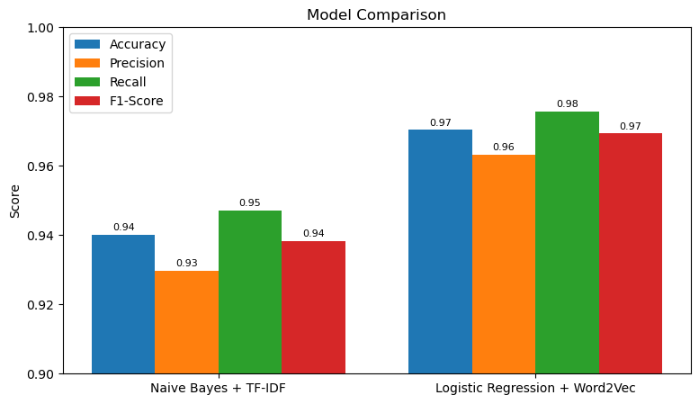
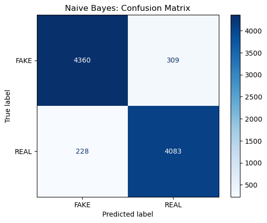
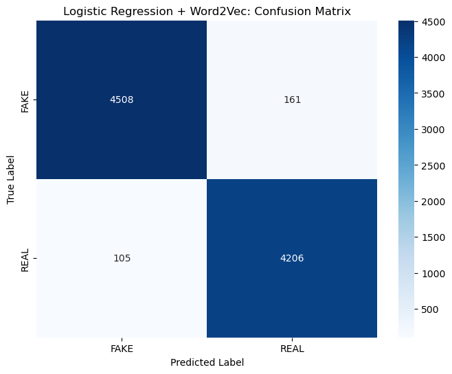

# Fake News Detection

A text classification project that labels news articles as **real** or **fake**, and compares two approaches: a statistical model on TF-IDF features and an embedding-based model on Word2Vec. Built in Python with scikit-learn, NLTK and gensim.

[](https://colab.research.google.com/github/ziadelh/natural-language-processing/blob/main/fake_news_detection.ipynb)



| Model | Accuracy | Precision | Recall | F1 |
|---|---|---|---|---|
| Naive Bayes + TF-IDF | 94% | 93% | 95% | 94% |
| Logistic Regression + Word2Vec | **97%** | 96% | 98% | 97% |

Precision, recall and F1 are for the *real* class. Evaluated on a held-out 20% test split of about 9,000 articles.

<table>
  <tr>
    <td></td>
    <td></td>
  </tr>
</table>

## What it does

- **Preprocessing:** lowercasing, removing punctuation and numbers, tokenizing, removing stop words, lemmatizing
- **Statistical baseline:** TF-IDF features with a Multinomial Naive Bayes classifier
- **Embedding model:** Word2Vec trained on the training split only, with each article represented by the average of its word vectors, classified with Logistic Regression
- **Evaluation:** accuracy, precision, recall, F1, confusion matrices and a side-by-side comparison chart

## Dataset

[Fake and Real News Dataset](https://www.kaggle.com/datasets/clmentbisaillon/fake-and-real-news-dataset) on Kaggle: about 21,400 real and 23,500 fake articles. Download it and place `True.csv` and `Fake.csv` in a `data/` folder next to the notebook (the CSVs are too large to include here).

## Run

```bash
pip install pandas numpy scikit-learn nltk gensim seaborn matplotlib jupyter
jupyter notebook fake_news_detection.ipynb
```

The notebook downloads the NLTK data it needs on the first run. Or use the **Open in Colab** button above and upload the two CSV files into a `data/` folder.

## Tech Stack

Python · pandas · scikit-learn · NLTK · gensim (Word2Vec) · matplotlib · seaborn

## Author

Ziad Elhussein
